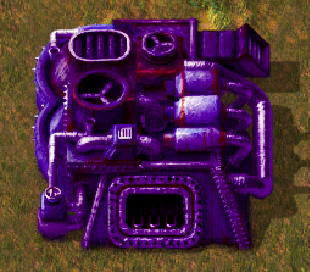
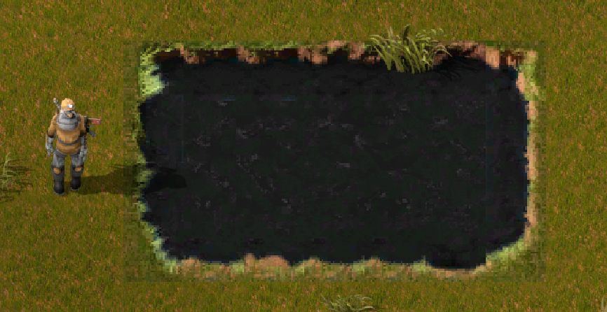

# SquidInk

A Mod for Factorio

Adds a Faster Electric Furnace, a Faster Centrifuge and some defensive inked floors to slow enemies.

## How To Use

Yoy can get the latest from Github or Mods.Factorio.com

- Get the Zip file from Releases [here](https://github.com/Coryf65/SquidInk/releases)

- Get the Mod file from [Factorio Mod website](https://mods.factorio.com/mod/SquidInk)

- Get the Mod from the in-game Mod Downloader 

## Current Items

1. Squid Plates (*a plate used to craft other items in this mod*)

  

2. Squid Furnace (*an upgraded electric furnace*)

  

  - :heavy_check_mark: `8x` faster electric furnace 
  - :heavy_check_mark: `6` module slots : `2` more than the base one
  - :heavy_check_mark: more health : `400hp`
  - :heavy_minus_sign: more power draw : `250kW`

3. Inked Floor (*a floor tile that slows enemies*)

  

4. Squid Centrifuge (*an upgraded centrifuge*)

  
  
  - :heavy_check_mark: `8x` Faster Centrifuge
  - :heavy_check_mark: more health `550hp`
  - :heavy_minus_sign: more power draw : `600kW`

## Planned Items

1. Uranium Recipe : *Creates Uranium 235 from 238 and Squid Ink*

2. Squid Squeezer : *Collects Squid Ink from fish Used to replace Oil*

3. Mark 2 Suid Furnace : *more energy effecient and more speed*

4. A pump that filters out "Squid" from the water. This would replace the fish with the new squid item *needs to be easy and a early recipe*

5. Maybe add a settings mod file for tweaking settings? (*need to figure out how to do this*)

## Current Research Path Plans

1. Squid Tech
  - Base items = Squid-Plates, Squid-Furnace, Squid-Centrifuge

2. Squid Cooking - WIP

  - Squid Furnace mark 2 - WIP
  
3. Ink Processing - WIP

  - Fish squeezer to make oil "squid ink" - WIP

## Dev Notes

- `buildMod.py` will compress the current mod into a folder ready to upload into Factorio Mods and GitHub.

### Some helpful Docs for others

- Console Commands
[Factorio Console Commands](https://wiki.factorio.com/Console)

- Data Names (useful for cheating items when testing)
[Factorio Item Names](https://wiki.factorio.com/Data.raw)

- API Documentation
[Factorio API](https://lua-api.factorio.com/latest/)

- Modding Guide / Tutorials
[Factorio Modding Guide](https://wiki.factorio.com/Modding)
Great [post](https://forums.factorio.com/viewtopic.php?t=12564) about modding on the Forums by [engineer13](https://forums.factorio.com/memberlist.php?mode=viewprofile&u=7441)

- Other Modders for examples
  - [ReikaKalseki's Fast Furnaces](https://github.com/ReikaKalseki/FastFurnaces) -> which SquidFurnace is based on
  - [Tone's More_Floors](https://mods.factorio.com/mod/More_Floors) -> Which InkedFloors is based on the tar

Base Game path for examples, in your game install

  `X:\Steam\steamapps\common\Factorio\data\base`

Mods folder location 
  > your PCs username in replace of mine

`C:\Users\Cory\AppData\Roaming\Factorio\mods`

#### Glossary

WIP = Work In Progress, not implemented yet
